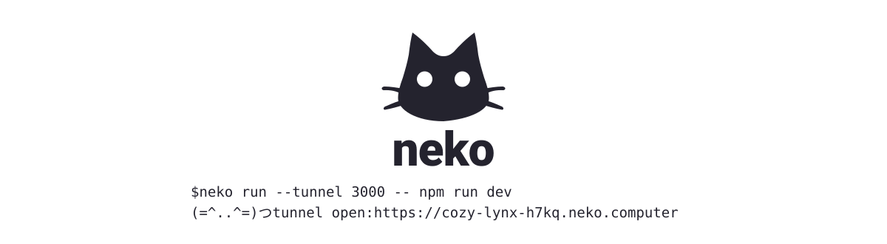

<p align="center">
  <picture>
    <source media="(prefers-color-scheme: dark)" srcset="assets/banner-dark.svg">
    
  </picture>
</p>

Expose a sandbox or a local port to the public web with one command, at `<name>.neko.computer`.

## Install

macOS and Linux, both aarch64:

```
curl -fsSL https://install.neko.computer | sh
```

Or with Homebrew: `brew install superhq-ai/tap/neko`. Update later with `neko upgrade`.

## Usage

```
neko login                              # sign in via the SuperHQ device grant (app.superhq.ai)
neko tunnel 3000                        # tunnel a local 127.0.0.1:3000 port (no sandbox)

neko run --port 3000 -- npm run dev     # reach the sandbox from your machine, no account
neko run --tunnel 3000 -- npm run dev   # anonymous, ephemeral sandbox, public URL
neko run alice --tunnel 3000 -- npm run dev            # a persistent named computer
neko run base --checkpoint clean -- sh -c 'apt-get install -y python3'   # build a reusable checkpoint
neko run web --from base@clean --tunnel 3000 -- python3 -m http.server 3000
```

Managing computers and checkpoints:

```
neko clone base@clean staging   # a computer from a ref (shared node) or an image file
neko ls                         # list computers
neko history alice              # the checkpoint history of a computer
neko rm alice                   # remove a computer and reclaim its orphaned checkpoints
neko gc                         # sweep checkpoints orphaned by crashes or interrupted ops
```

`--port` forwards a sandbox port to `127.0.0.1` on your machine, which is all local: no account, no sign-in, nothing hosted. Use `--port 3000:8000` for a different host port. `--tunnel` is the same plumbing pointed at the public internet instead, which needs SuperHQ Pro.

A **computer** is a named, versioned sandbox: a branch ref over a shared tree of **checkpoints** (immutable disk snapshots). `neko run NAME` resumes from the computer head; `--from` branches from a checkpoint; `--checkpoint` snapshots on the way down. Opening a tunnel requires `neko login`.

### Sandboxes

`neko run` boots an isolated Linux microVM, mounts the current directory at `/workspace`, and runs the command there. argv is passed directly, with no shell, so pipes and `&&` need an explicit `sh -c`. The base image is a minimal Debian: install what the command needs inline, or bake it into a checkpoint. The image downloads on first run.

### Web terminal

`neko run --term` puts a terminal into the sandbox on the web: it opens a private tunnel of its own and serves the terminal at `https://<name>.neko.computer/__neko/term` (the bare URL redirects there). Only members of your workspace can open it (`--private SLUG` to name one), and each visit gets its own login shell. Add `--tunnel PORT` to expose an app port on the same tunnel alongside the terminal.

```
neko run --term                         # a computer in the browser
neko run alice --term                   # a persistent one
neko run --term --tunnel 3000 -- npm run dev   # app plus terminal
```

## Agent skill

neko ships as an [agent skill](https://agentskills.io) so coding agents (Claude Code, Cursor, Copilot, and more) can open a tunnel whenever they need a public URL for a sandbox or a local port.

```sh
# Install with the skills CLI
npx skills add superhq-ai/neko-computer

# Or copy it into your project manually
cp -r skills/neko .claude/skills/neko
```

The skill lives at [skills/neko/SKILL.md](skills/neko/SKILL.md).

## Self-hosting

The edge worker is a library: deploy your own tunnel domain and point the CLI at it. See [docs/self-hosting.md](docs/self-hosting.md).

## Layout

- `crates/neko` the Rust CLI
- `edge` the Cloudflare tunnel Worker and Durable Object
- `skills/neko` the agent skill
- `docs` the tunnel protocol, self-hosting, and development notes

The wire protocol is specified in [docs/specs/tunnel-protocol.md](docs/specs/tunnel-protocol.md).

## License

Apache-2.0. See [LICENSE](LICENSE).
